# DC Universe Heroes — mod para Minecraft Java 1.21.11 (Forge)

> *"No dia mais claro, na noite mais densa, o mal sucumbirá ante a minha presença!"*

Mod de heróis do **Universo DC** para **Minecraft Java 1.21.11** com **Forge 61.2.0** (compilado com **Java 25**).
Começou como o mod do Lanterna Verde e agora traz também **o Flash** (v1.7.0). O id do mod continua `greenlantern`, então mundos e configurações antigas continuam funcionando.

## O Flash (novo na 1.7.0)

* **Anel do Flash:** guarda o traje, como o do Barry Allen. Clique direito ou **G** para vestir (capuz, traje, calças e botas). Um herói por vez: vestir o Flash tira o uniforme do Lanterna e vice-versa.
* **Supercorrida progressiva:** com o traje, corra (sprint) e segure **W**. A velocidade não para de subir: rompe a barreira do som em ~4 segundos (com estrondo, anel dourado e flash na tela) e continua acelerando. Rastro de raios amarelos e borrão vermelho, câmera com FOV esticado, linhas de velocidade, velocímetro em km/h e trilha sonora original que explode na barreira do som.
* **Corre sobre a água**, **corre na vertical** subindo paredes (pulo = salta da parede, continue para passar por cima) e **super pulo** quando pula correndo (quanto mais rápido, mais alto). Sem dano de queda.
* **Força de Aceleração:** a energia dos poderes (barra amarela). Recarrega devagar com o traje e bem mais rápido correndo.
* **Menu radial de poderes** (segure **R**; **V** usa o poder):
  * **Tornado:** o Flash corre em círculos e cria um vórtice que puxa, levanta, gira e machuca as criaturas, e arremessa todas no final.
  * **Vibração Molecular:** atravessa blocos e ataques. Você não cai (pulo/agachar sobe/desce) e, ao terminar, é sempre levado ao lugar livre mais próximo com chão firme: nada de sufocar na parede ou cair infinitamente.
  * **Raio da Força de Aceleração:** um raio que salta para mais dois inimigos; correndo rápido ele acerta até 75% mais forte.

## Capturas (tiradas automaticamente no jogo)

| | |
| --- | --- |
| 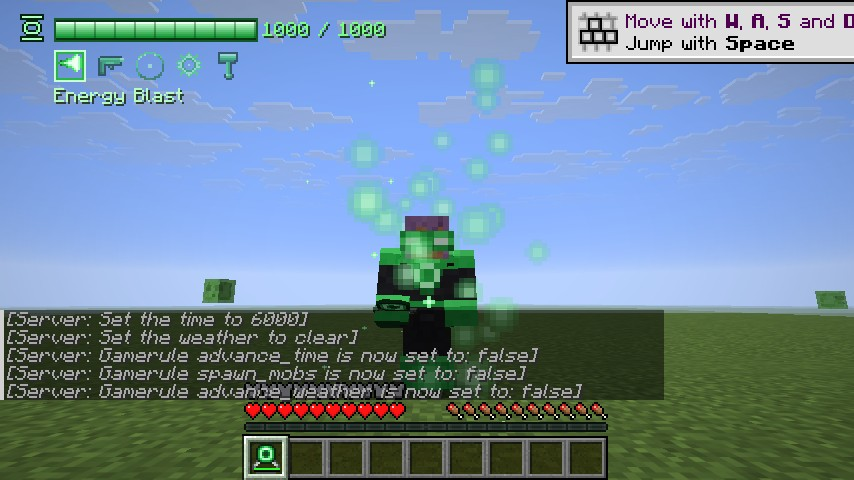 | 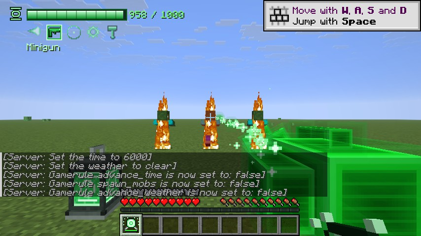 |
| 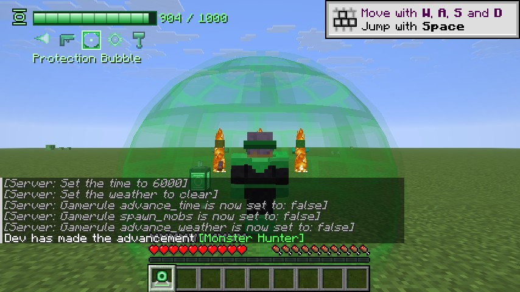 | 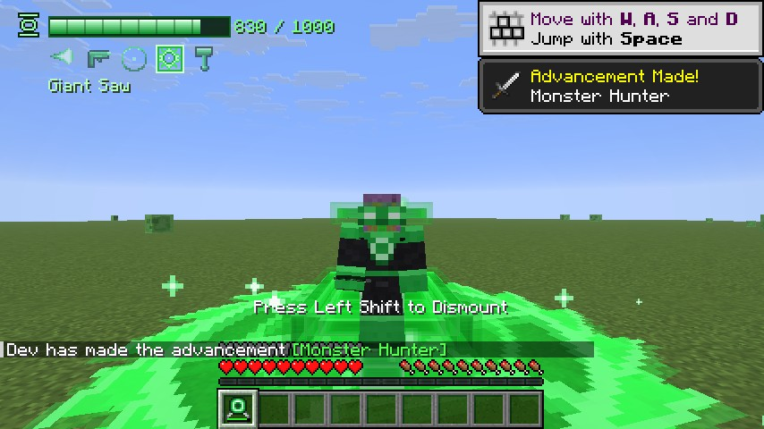 |
| 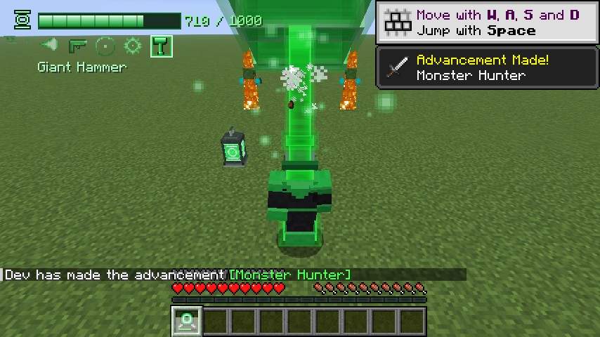 | 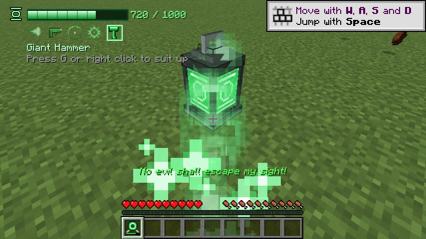 |

### Roda de construtos

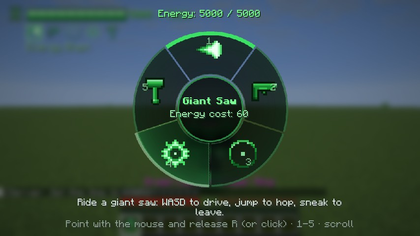

### Oa, o planeta da Tropa

Uma dimensão própria com noite eterna sob um céu estrelado verde e uma música ambiente original.

| | |
| --- | --- |
| 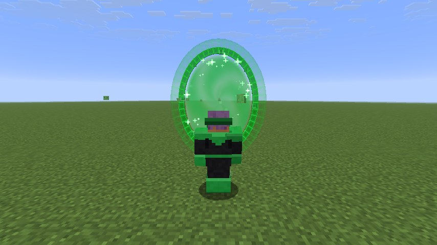 | 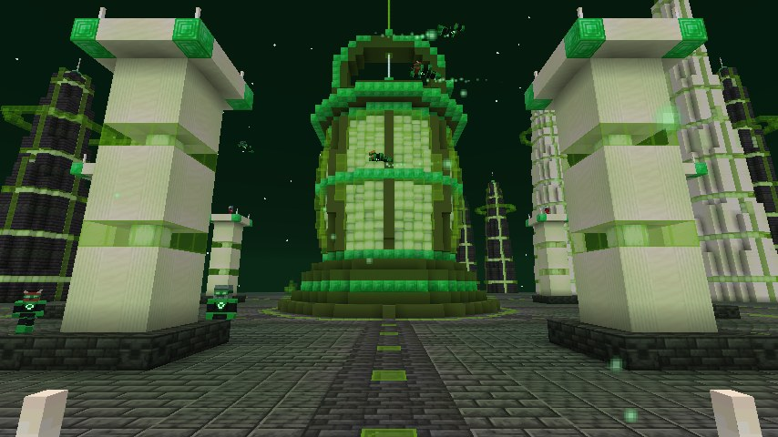 |
| 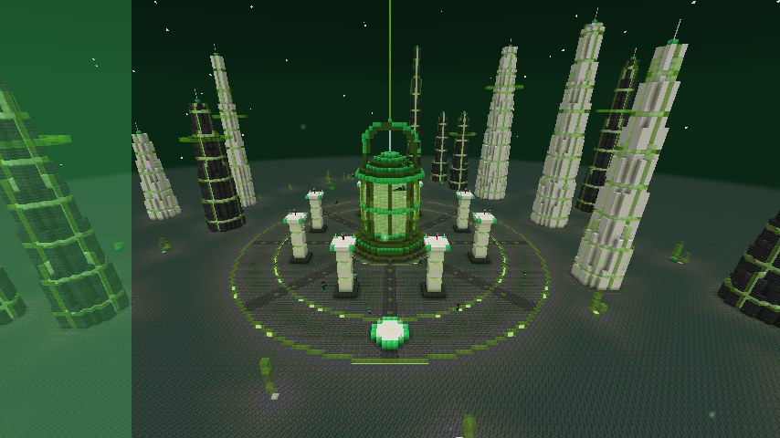 | 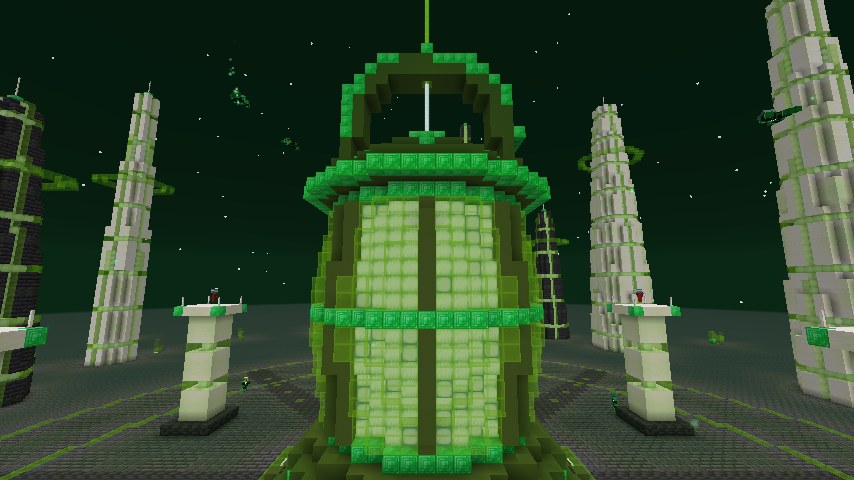 |
| 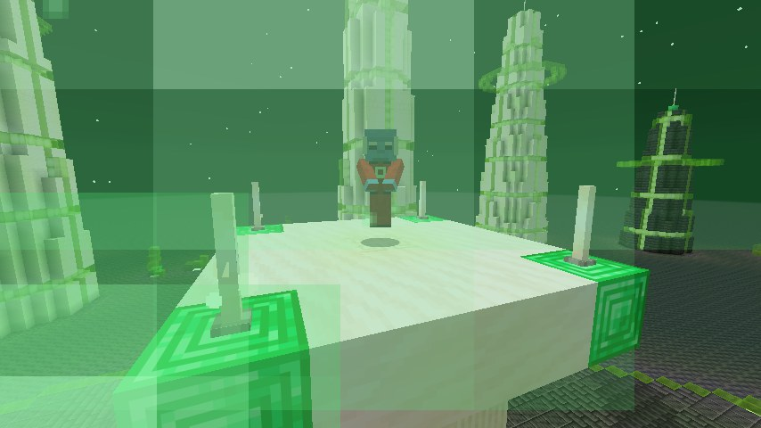 | 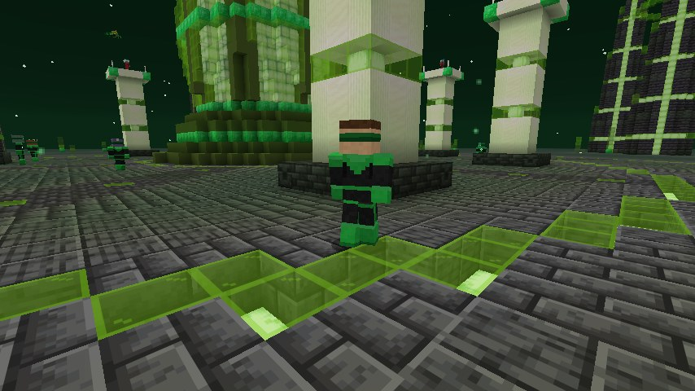 |

* **Bateria Central de Energia:** uma lanterna gigante de 36 blocos no centro da grande praça, com um feixe verde que sobe ao céu. Perto dela o anel recarrega sozinho.
* **Guardiões do Universo:** oito Guardiões flutuam sobre pilares em volta da Bateria. Clique neles para ouvir sua sabedoria; eles também enchem o seu anel.
* **Outros Lanternas:** Lanternas de oito espécies diferentes andam pela praça e patrulham o céu voando em volta da Bateria. Clique para conversar.
* **Cidade:** praça escura com anéis de luz verde e oito avenidas, torres de pedra escura e quartzo com janelas verdes e anéis de luz flutuantes, cristais verdes nas planícies e um tablado de chegada.
* Sem monstros. A cidade é construída na primeira visita e é a mesma em todo mundo.

### Voo de poder

| | |
| --- | --- |
| 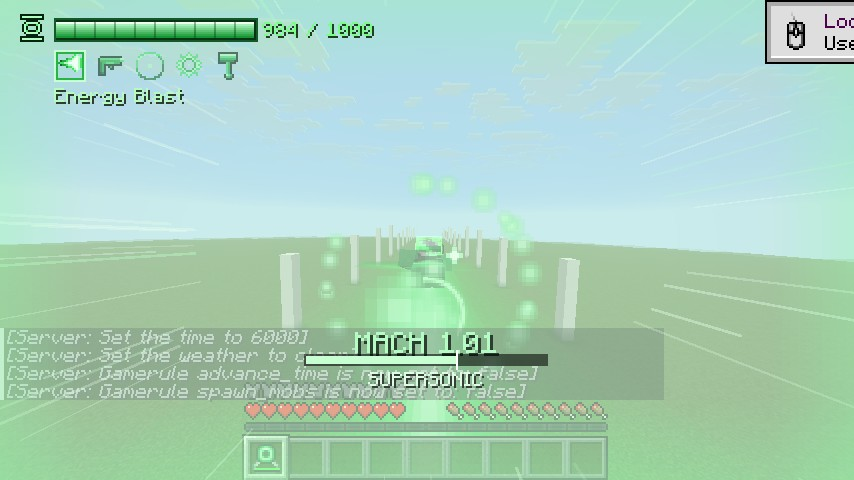 | 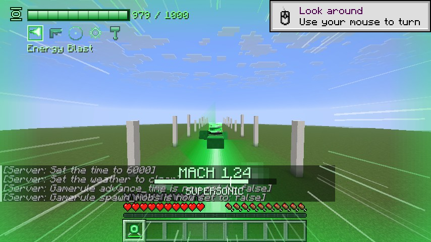 |
| 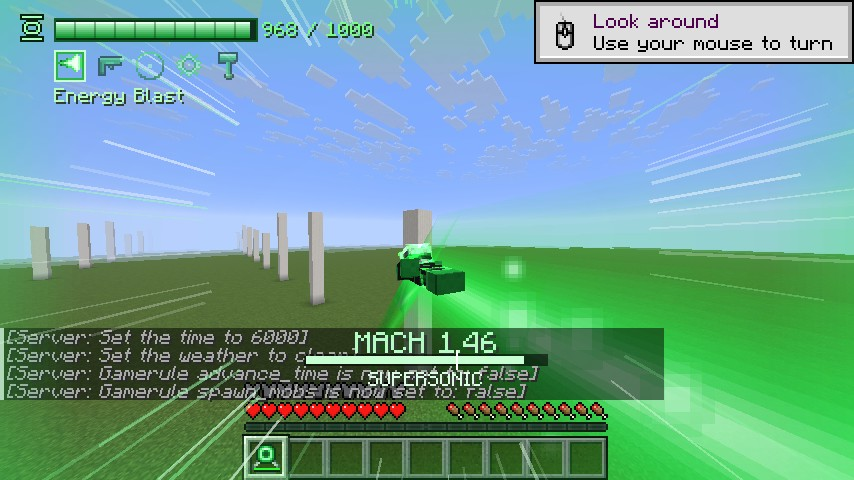 | 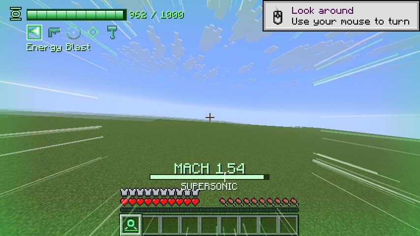 |
| 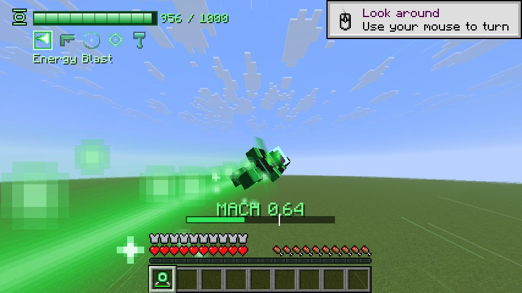 | 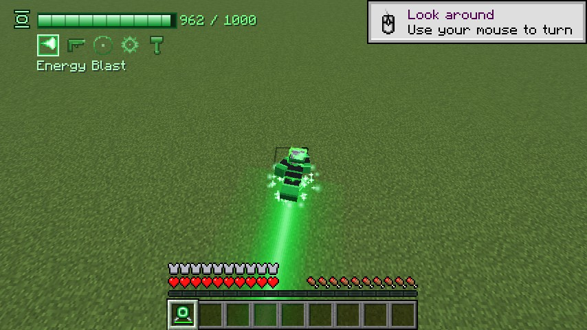 |

## Conteúdo

| Item / recurso | Descrição |
| --- | --- |
| **Anel de Poder** | Um anel recém-fabricado vem **descarregado**: carregue-o na Bateria de Poder antes de usar. Veste o uniforme dos Lanternas Verdes, dá voo e cria construtos de luz sólida. Tem **energia finita** (barra no slot, tooltip e HUD). |
| **Bateria de Poder (lanterna)** | Bloco 3D animado que recarrega o anel. Clique com o anel na mão e fique perto: a energia flui da lanterna para o anel enquanto o juramento aparece na tela. |
| **Uniforme** | Máscara, uniforme, calças e botas de luz sólida (proteção equivalente a diamante). Guardam a armadura que você usava e a devolvem ao remover o uniforme. Não podem ser tirados nem dropados. |
| **Manual da Tropa** | Livro guia para quem usa o mod pela primeira vez: todo jogador ganha um ao entrar num mundo pela primeira vez (também sai da receita livro + esmeralda e está na aba criativa). Clique direito para abrir: capítulos sobre o anel, a bateria, o uniforme, o voo, cada construto, os controles, as receitas (com a grade de fabricação) e dicas. |
| **Voo de poder** | Com o uniforme: dois toques no pulo para decolar (com explosão de energia no chão). Segure **para frente** e a velocidade vai **aumentando sem parar** até **quebrar a barreira do som** (estrondo sônico, anéis de vapor, flash na tela) e passar de Mach 1. Ver detalhes em *Voo de poder* abaixo. |

### Construtos

| # | Construto | Uso | Efeito |
| --- | --- | --- | --- |
| 1 | **Disparo de Energia** | Clique direito | Esfera pesada de luz sólida que explode no impacto (dano em área, sem quebrar blocos). |
| 2 | **Metralhadora** | Segure o clique direito | Metralhadora giratória de 6 canos flutua ao lado da mão e dispara uma rajada contínua. |
| 3 | **Bolha de Proteção** | Clique para ligar/desligar | Esfera ao redor do jogador: absorve 85% do dano, empurra criaturas e reflete projéteis. Consome energia por segundo. |
| 4 | **Serra Gigante** | Clique para invocar/dispensar | Veículo: você fica em pé numa prancha de luz com uma serra circular gigante na frente. **W/S** acelera/ré, **A/D** desliza para os lados, o **mouse** dá a direção, **pulo** salta e **agachar** sai. Retalha criaturas e corta folhas, troncos e plantas. |
| 5 | **Martelo Gigante** | Clique direito | Um martelo gigante surge no ponto para onde você olha, golpeia o chão e solta uma onda de choque que causa dano e arremessa tudo em volta (com tremor de câmera). |
| 6 | **Broca Gigante** | Clique para invocar/dispensar | Veículo de escavação: você senta numa cabine sobre esteiras com uma broca gigante na frente que aponta para onde você olha. **W** perfura nessa direção (olhando para a frente cava túneis retos com o chão plano, para baixo cava poços, para cima perfura o teto), **S** ré, **A/D** desliza, **pulo** salta e **agachar** sai. Minera pedra, terra, areia, cascalho e todos os minérios (obsidiana demora mais, rocha-matriz nunca), manda os itens direto para o inventário e solta a experiência dos minérios. Encostada na rocha, se segura nas paredes. A ponta giratória fere criaturas. |
| 7 | **Mecha Gigante** | Clique para invocar, **agachar** sai | Armadura de luz sólida com **10 blocos de altura**: você pilota sentado na cabine do peito e fica **protegido de todo dano** (o mecha absorve golpes, flechas e explosões gastando energia do anel; também não deixa você se afogar nem pegar fogo). **W/S** anda, **A/D** passo lateral, **Ctrl** corre; o tronco gira para a mira e as pernas acompanham devagar, com passos que tremem a câmera. **Segure pulo** para os propulsores esquentarem e o mecha decolar; no ar **W** voa para onde você olha, **Ctrl** liga o pós-combustor e soltar o pulo faz pairar. Aterrissagem forte solta onda de choque. **Segure o clique direito**: dois raios laser saem dos canhões dos punhos (ferem e incendeiam). **Clique esquerdo**: rajada de 6 mísseis teleguiados dos ombros. |
| 8 | **Portal para Oa** | Clique direito | Abre um oval de luz sólida à sua frente: atravesse para ir ao planeta **Oa**, o lar da Tropa. Em Oa, o mesmo construto abre o caminho de volta para onde você estava. O portal fica aberto 20 segundos para os amigos irem junto. |

### Voo de poder

* **Aceleração contínua:** segure **W** voando e a velocidade cresce de cruzeiro até Mach 1 em ~5 s (com **Ctrl/correr**, mais rápido) e continua até ~Mach 1,5.
* **Voe para onde olha:** a direção segue a câmera, com mais inércia quanto mais rápido (curvas largas e pesadas, a câmera inclina nas curvas).
* **Pose de super-herói:** em alta velocidade o Lanterna voa deitado, punho à frente; subindo na vertical, fica em pé como numa decolagem.
* **Aura verde** pulsante em volta do corpo e **rastro de energia** longo atrás de você (maior e mais duradouro em velocidade supersônica), além de faíscas e rajadas de luz.
* **Sensação de velocidade:** FOV aumenta com a velocidade, linhas de velocidade na tela, vento que sobe de tom, tremor da câmera em velocidade supersônica, medidor de Mach na tela.
* **Barreira do som:** estrondo sônico, anéis de vapor perpendiculares ao voo, flash e "SUPERSÔNICO" no HUD. Os outros jogadores ouvem o estrondo de longe.
* **Manobras:**
  * **Barrel roll** – toque duas vezes **A** ou **D** em alta velocidade: giro de 360° com esquiva lateral (a câmera gira junto).
  * **Freio aéreo** – segure **S** em alta velocidade: o Lanterna se endireita e freia.
  * **Decolagem explosiva** – comece a voar perto do chão.
  * **Pouso de herói** – mergulhe em alta velocidade contra o chão: onda de choque que causa dano e arremessa criaturas em volta (você não toma dano).
* **Trilha sonora épica dinâmica:** ao voar rápido entra uma trilha heroica original; quando você quebra a barreira do som entra a camada épica completa (metais, coral e percussão). Ela some suavemente quando você desacelera. Usa o volume de *Música*.
* Bater de frente numa parede em alta velocidade faz você perder o embalo (o anel te protege do dano).
* Voar mais rápido consome mais energia (até 3× em velocidade máxima).

#### Usando sua própria música

Por direitos autorais, o mod não pode incluir músicas de terceiros, como a trilha da série *Lanterns*. Mas você pode trocar a trilha do voo por qualquer música **para uso pessoal**: o build gera `greenlantern-custom-flight-music-resourcepack.zip` (fonte em `extras/custom-flight-music-pack/`). Coloque sua música convertida para `.ogg` como `assets/greenlantern/sounds/music/custom_flight_theme.ogg` dentro do zip, ponha o zip em `resourcepacks/` e ative-o em *Opções → Pacotes de Recursos*. Instruções completas no `LEIA-ME.txt` do pacote.

### Controles (configuráveis em *Opções → Controles → Atalhos → Universo DC*)

| Tecla | Ação |
| --- | --- |
| **Clique direito** com o anel | Sem uniforme: veste o uniforme. Com uniforme: usa o construto selecionado. |
| **G** | Vestir / remover o uniforme |
| **R** (segurar) | Abre a **roda de construtos** (estilo *weapon wheel* do GTA V): aponte com o mouse e solte R (ou clique). Também aceita as teclas **1–6** e a rodinha do mouse |
| **R** (toque rápido) | Próximo construto |
| **Shift + roda do mouse** (anel na mão) | Troca de construto |
| **Dois toques no pulo** (com uniforme) | Decolar / parar de voar |
| **W** voando (segure) / **Ctrl** | Acelerar até a barreira do som / acelerar mais rápido |
| **A A** ou **D D** voando rápido | Barrel roll |
| **S** voando rápido | Freio aéreo |
| Clique direito na **Bateria de Poder** com o anel | Começa ou interrompe a recarga |
| **Correr (Ctrl)** com o traje do Flash | Começa a supercorrida (segure **W**; **S** derrapa; agachar desacelera) |
| **Pulo** correndo | Super pulo (na parede: salta da parede) |
| **R** (segurar / tocar) com o traje do Flash | Menu radial de poderes / próximo poder |
| **V** | Usa o poder do Flash escolhido |

### Receitas

```
Anel de Poder            Bateria de Poder
 .  D  .                  I  G  I
 E  .  E                  G  L  G
 .  E  .                  I  B  I
D = diamante, E = esmeralda      I = barra de ferro, G = vidro tingido de lima,
                                 L = lanterna, B = bloco de esmeralda
```

**Manual da Tropa:** livro + esmeralda (sem forma).

```
Anel do Flash
 R  G  R
 G  P  G       R = redstone, G = barra de ouro, P = para-raios
 R  G  R
```

Também estão na aba criativa **Heróis do Universo DC** (inclui os anéis já carregados).

### Configuração

Todos os números de balanceamento (energia máxima, custo de cada construto, dano, velocidades do voo, Mach 1, tempo até a barreira do som, pouso de herói, se a serra corta plantas, velocidade de mineração e dureza máxima da broca, se ela manda os itens para o inventário, se o manual é dado na primeira entrada etc.) ficam em `config/greenlantern-common.toml`, gerado na primeira execução.

Preferências visuais e de som ficam em `config/greenlantern-client.toml`: ligar/desligar a trilha do voo e seu volume, efeitos de câmera (tremor, inclinação, giro), linhas de velocidade/medidor de Mach e rastros.

---

## Instalação (para jogar)

### Opção A — CurseForge App, importando o perfil pronto (mais fácil)

O build gera `greenlantern-1.21.11-1.6.0-curseforge-profile.zip`, um perfil do CurseForge que já configura o **Minecraft 1.21.11 + Forge 61.2.0** e já traz o mod dentro.

1. Abra o **CurseForge App** → **Minecraft** → **Create Custom Profile**.
2. Clique em **Import** (canto superior da janela) e escolha o arquivo `...-curseforge-profile.zip`.
3. Aguarde o CurseForge baixar o Minecraft e o Forge e clique em **Play**.

### Opção B — CurseForge App, perfil manual

1. Abra o **CurseForge App** → **Minecraft** → **Create Custom Profile**.
2. Em *Game Version* escolha **1.21.11**, em *Modloader* escolha **Forge** e selecione a versão **61.2.0** (ou mais recente da série 61.x). Clique em **Create**.
3. No perfil criado, clique nos **três pontinhos (⋮)** → **Open Folder**. Entre na pasta `mods` (crie se não existir).
4. Copie o arquivo `greenlantern-1.21.11-1.6.0.jar` para dentro de `mods`.
5. Volte ao CurseForge e clique em **Play**. O mod aparece na lista *Mods* do menu principal do jogo.

> Não é preciso instalar Java separadamente: o CurseForge e o launcher oficial usam o Java que vem com o Minecraft 1.21.11. O jar foi compilado com o JDK 25, mas gera bytecode Java 21, então roda tanto no Java 21 do launcher quanto no Java 25.

### Opção C — Launcher oficial

1. Baixe o instalador do Forge **1.21.11 – 61.2.0** em <https://files.minecraftforge.net/net/minecraftforge/forge/index_1.21.11.html> e execute-o (*Install client*).
2. Abra a pasta do jogo (`%appdata%\.minecraft` no Windows, `~/Library/Application Support/minecraft` no macOS, `~/.minecraft` no Linux) e coloque o jar em `mods/`.
3. No launcher, escolha o perfil **forge 1.21.11** e clique em **Jogar**.

### Servidor dedicado

Instale o servidor Forge 1.21.11-61.2.0 (*Install server* no mesmo instalador) e coloque o jar em `mods/` do servidor. **Todos os jogadores** também precisam do mod.

---

## Como testar no jogo (roteiro rápido)

1. Crie um mundo (Criativo facilita; em Sobrevivência dá para testar o consumo de energia).
2. Pegue o **Anel de Poder** e a **Bateria de Poder** na aba criativa *Tropa dos Lanternas Verdes*.
3. Clique direito com o anel (ou **G**): o uniforme aparece com som e partículas, e o HUD de energia surge no canto superior esquerdo.
4. Dois toques no pulo para **voar**.
5. Troque de construto com **R** e teste cada um. Invoque alguns zumbis como alvo (`/summon zombie`).
6. Em Sobrevivência, gaste a energia e depois coloque a **Bateria de Poder** no chão, clique nela com o anel na mão e fique perto até carregar.

---

## Compilação (para desenvolvedores)

### Requisitos

* **JDK 25** (Temurin/Adoptium recomendado). Se não estiver instalado, o Gradle baixa sozinho um JDK 25 compatível (via *foojay toolchain resolver*); basta ter **qualquer Java 17+** para iniciar o Gradle.
* Internet na primeira compilação (Forge, Minecraft e bibliotecas são baixados e ficam em cache).
* Nada mais: o **Gradle Wrapper** (`gradlew`) já está no projeto.

### Comandos

```bash
# Windows: use gradlew.bat no lugar de ./gradlew
./gradlew build                          # gera build/libs/greenlantern-1.21.11-1.6.0.jar
                                         # e build/distributions/...-curseforge-profile.zip
./gradlew runClient                      # abre o Minecraft com o mod (ambiente de desenvolvimento)
./gradlew runServer                      # servidor de desenvolvimento
./gradlew runGameTestServer -Pgametests  # roda os testes automáticos dentro do jogo
```

O **CI do GitHub** (`.github/workflows/build.yml`) compila o mod, roda os testes e publica o jar como *artifact* a cada push. Dá para baixar o jar pronto na aba **Actions** do repositório.

### Testes automáticos

`src/gametest` tem GameTests do próprio Minecraft que rodam num servidor real, com um jogador de verdade em modo sobrevivência:

* uniforme: vestir, guardar e devolver a armadura;
* voo consome energia; o uniforme some quando a energia acaba;
* voo de poder: o estrondo sônico só é aceito acima da barreira do som, o pouso de herói só com velocidade e sem ferir o dono, e o custo de energia cresce com a velocidade;
* disparo de energia, metralhadora, bolha (empurrão, absorção de dano, consumo, desligar), serra (montar, cortar folhas, ferir, sumir ao desmontar), broca (minerar minério e pedra, manter o chão plano, itens no inventário, ferir, sumir ao desmontar), martelo (onda de choque, sem ferir o dono);
* a lanterna recarrega o anel até encher;
* receitas e tipo de dano carregados;
* o Manual da Tropa é dado ao jogador novo.

Esses testes só entram no build com `-Pgametests`, então nunca vão para o jar distribuído.

`GL_CLIENT_SCRIPT=1 ./gradlew runClient -Pgametests` roda um roteiro visual automático que cria um mundo plano, usa todos os recursos e salva screenshots em `run/screenshots/`.

### Estrutura do código

```
src/main/java/com/danrod505/greenlantern/
├── GreenLantern.java        # entrada do mod (registros, config, rede)
├── GLConfig.java            # todas as opções de balanceamento
├── registry/                # itens, blocos, entidades, sons, partículas, componentes, tipos de dano
├── ring/                    # energia do anel, uniforme, voo, eventos comuns
├── flight/                  # voo de poder no servidor (validação das manobras, pouso de herói)
├── construct/               # API de construtos + os 7 construtos (impl/)
├── entity/                  # entidades dos construtos e projéteis
├── block/                   # Bateria de Poder (bloco + block entity de recarga)
├── item/                    # Anel de Poder, peças do uniforme e Manual da Tropa
├── network/                 # pacotes cliente → servidor (teclas)
└── client/                  # renderizadores, partículas, HUD, roda de construtos, manual, teclas, tremor de câmera
    └── flight/              # física do voo, pose de herói, aura, rastro, câmera, HUD de Mach, vento e trilha
tools/                       # scripts Python que geram TODAS as texturas e sons
```

### Adicionando um novo construto

1. Crie uma classe em `construct/impl` estendendo `Construct` (escolha `INSTANT`, `HOLD` ou `TOGGLE` e implemente `activate`).
2. Registre-a em `ConstructRegistry` com uma linha `register(new MeuConstruto())`.
3. Adicione o ícone 16×16 em `tools/generate_textures.py` (tira `constructs.png`) e os nomes em `lang/en_us.json` e `lang/pt_br.json`.
4. Se precisar de entidade própria, registre em `ModEntities` e o renderizador em `ClientSetup`.

### Regerando texturas e sons

```bash
pip install pillow numpy scipy soundfile
python tools/generate_textures.py
python tools/generate_sounds.py
python tools/generate_flight_audio.py   # sons do voo e a trilha original (duas camadas)
python tools/generate_flash_textures.py # anel, traje, partículas e ícones do Flash
python tools/generate_flash_audio.py    # sons do Flash e a trilha original da corrida
```

## Licença

MIT. Green Lantern é uma marca da DC Comics; este é um projeto de fã, sem fins lucrativos e sem afiliação com a DC.
